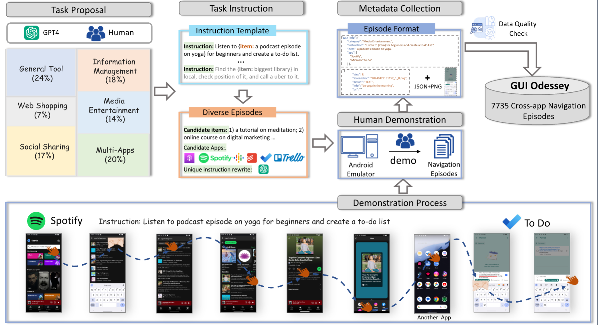

# GUIOdyssey

**This repository is the official implementation of GUIOdyssey.**

> [GUIOdyssey: A Comprehensive Dataset for Cross-App GUI Navigation on Mobile Devices](assets/GUIOdyssey.pdf)  
> Quanfeng Lu, Wenqi Shao✉️, Zitao Liu, Lingxiao Du, Fanqing Meng, Boxuan Li, Botong Chen, Siyuan Huang, Kaipeng Zhang, Ping Luo✉️


## 💡 News
- `2025/07/31`: 🔥🔥🔥 Latest version of [GUIOdyssey dataset](https://huggingface.co/datasets/hflqf88888/GUIOdyssey) released! Please check out [hflqf88888/GUIOdyssey](https://huggingface.co/datasets/hflqf88888/GUIOdyssey). We recommend using this new version of the dataset for training and evaluation!
- `2025/06/26`: 🎉🎉🎉 [GUIOdyssey paper](assets/GUIOdyssey.pdf) is accepted to ICCV 2025!
- `2024/06/24`: The first version of [GUIOdyssey dataset](https://huggingface.co/datasets/OpenGVLab/GUI-Odyssey) is released.
- `2024/06/13`: The [GUIOdyssey arXiv preprint (v1)](https://arxiv.org/pdf/2406.08451) has been released.


## 🔆 Introduction
GUIOdyssey is a comprehensive dataset for training and evaluating **cross-app** navigation agents. GUIOdyssey consists of 8,334 episodes from 6 mobile devices, spanning 6 types of cross-app tasks, 212 apps, and 1.4K app combos.   

For more details, please refer to our [latest paper](assets/GUIOdyssey.pdf).


## 🛠️ Data collection pipeline 
GUIOdyssey comprises six categories of navigation tasks. For each category, we construct instruction templates with items and apps selected from a predefined pool, resulting in a vast array of unique instructions for annotating GUI episodes. Human demonstrations on an Android emulator capture the metadata of each episode in a comprehensive format. After rigorous quality checks, GUIOdyssey includes 8,834 validated cross-app GUI navigation episodes.



## 💫 Dataset Access

The latest version of GUIOdyssey is hosted on [Huggingface](https://huggingface.co/datasets/hflqf88888/GUIOdyssey). 

Clone the entire dataset from Huggingface:

```shell
git clone https://huggingface.co/datasets/hflqf88888/GUIOdyssey
```
Make sure your screenshots are organized in the following structure:


```
GUI-Odyssey
├── data
│   ├── annotations
│   │   └── *.json
│   ├── screenshots
│   │   └── *.png
│   ├── splits
│   │   ├── app_split.json
│   │   ├── device_split.json
│   │   ├── random_split.json
│   │   └── task_split.json
│   └── format_converter.py
└── ...
```


## ⚙️ Detailed Data Information
Please refer to [this](introduction.md).


## 🚀 Quick Start

Please refer to [this](Quickstart.md) to quick start.


## 🖊️ Citation 
If you feel GUIOdyssey useful in your project or research, please kindly use the following BibTeX entry to cite our paper. Thanks!
```bib
@article{lu2024gui,
  title={GUI Odyssey: A Comprehensive Dataset for Cross-App GUI Navigation on Mobile Devices},
  author={Lu, Quanfeng and Shao, Wenqi and Liu, Zitao and Meng, Fanqing and Li, Boxuan and Chen, Botong and Huang, Siyuan and Zhang, Kaipeng and Qiao, Yu and Luo, Ping},
  journal={arXiv preprint arXiv:2406.08451},
  year={2024}
}
```
