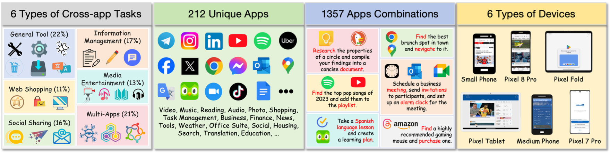
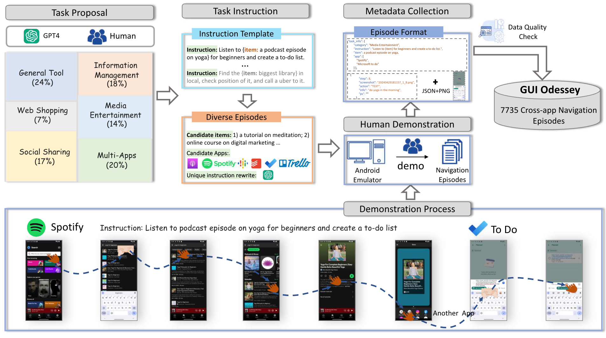

# GUI Odyssey

**This repository is the official implementation of GUI Odyssey.**

> [GUI Odyssey: A Comprehensive Dataset for Cross-App GUI Navigation on Mobile Devices](https://arxiv.org/abs/2406.08451)  
> Quanfeng Lu, Wenqi Shao✉️⭐️, Zitao Liu, Fanqing Meng, Boxuan Li, Botong Chen, Siyuan Huang, Kaipeng Zhang, Yu Qiao, Ping Luo✉️  
> ✉️  Wenqi Shao (shaowenqi@pjlab.org.cn) and Ping Luo (pluo@cs.hku.hk) are correponding authors.   
> ⭐️ Wenqi Shao is project leader.   


## 💡 News

- `2024/06/13`: The paper of [GUI Odyssey](https://arxiv.org/pdf/2406.08451) is released! 
<!-- And check our [project page]()! -->

## 📖 Release Process

- [x] Dataset
  - [x] Screenshots of GUI Odyssey
  - [x] annotations of GUI Odyssey
  - [x] split files of GUI Odyssey
- [ ]  Code
  - [ ] data preprocessing code
  - [ ] inference code
- [ ]  Models


## 🔆 Introduction
GUI Odyssey is a comprehensive dataset for training and evaluating **cross-app** navigation agents. GUI Odyssey consists of 7,735 episodes from 6 mobile devices, spanning 6 types of cross-app tasks, 201 apps, and 1.4K app combos.



## 🛠️ Data collection pipeline 
GUI Odyssey comprises six categories of navigation tasks. For each category, we construct instruction templates with items and apps selected from a predefined pool, resulting in a vast array of unique instructions for annotating GUI episodes. Human demonstrations on an Android emulator capture the metadata of each episode in a comprehensive format. After rigorous quality checks, GUI Odyssey includes 7,735 validated cross-app GUI navigation episodes.



## 📝 Statistics

<center>

Splits                      | # Episodes        | # Unique Prompts  | # Avg. Steps     | Data location
:---------:                 | :---------:       | :-----------:     | :--------------: | :-----------:
**Total**                   | **7,735**         | **7,735**         | **15.4**         | https://huggingface.co/datasets/OpenGVLab/GUI-Odyssey
Train-Random \& Test-Random | 5,802 / 1,933     | 5,802 / 1,933     | 15.4 / 15.2      | https://huggingface.co/datasets/OpenGVLab/GUI-Odyssey/blob/main/splits
Train-Task \& Test-Task     | 6,719 / 1,016     | 6,719 / 1,016     | 15.0 / 17.6      | https://huggingface.co/datasets/OpenGVLab/GUI-Odyssey/blob/main/splits
Train-Device \& Test-Device | 6,473 / 1,262     | 6,473 / 1,262     | 15.4 / 15.0      | https://huggingface.co/datasets/OpenGVLab/GUI-Odyssey/blob/main/splits
Train-App \& Test-App       | 6,596 / 1,139     | 6,596 / 1,139     | 15.4 / 15.3      | https://huggingface.co/datasets/OpenGVLab/GUI-Odyssey/blob/main/splits

</center>

## 💫 Dataset Access

The whole GUI Odyssey is hosted on [Huggingface](https://huggingface.co/datasets/OpenGVLab/GUI-Odyssey). 

Clone the entire dataset from Huggingface:
```shell
git clone https://huggingface.co/datasets/OpenGVLab/GUI-Odyssey
```
And then move the cloned dataset into `./data` directory. After that, the `./data` structure should look like this:


```
GUI-Odyssey
├── data
│   ├── annotations
│   │   └── *.json
│   ├── screenshots
│   │   └── data_*.json
│   ├── splits
│   │   ├── app_split.json
│   │   ├── device_split.json
│   │   ├── random_split.json
│   │   └── task_split.json
│   └── preprocessing.py
└── ...
```

Then organize the screenshots folder:

```shell
cd data
python preprocessing.py
```

Finally, the `./data` structure should look like this:

```
GUI-Odyssey
├── data
│   ├── annotations
│   │   └── *.json
│   ├── screenshots
│   │   └── *.png
│   ├── splits
│   │   ├── app_split.json
│   │   ├── device_split.json
│   │   ├── random_split.json
│   │   └── task_split.json
│   └── preprocessing.py
└── ...
```


## ⚙️ Detailed Data Information
Please refer to [this](introduction.md).


## 🚀 Quick Start

Please refer to [this](Quickstart.md) to quick start.


## 🖊️ Citation 
If you feel GUI Odyssey useful in your project or research, please kindly use the following BibTeX entry to cite our paper. Thanks!
```bib
@misc{lu2024gui,
      title={GUI Odyssey: A Comprehensive Dataset for Cross-App GUI Navigation on Mobile Devices}, 
      author={Quanfeng Lu and Wenqi Shao and Zitao Liu and Fanqing Meng and Boxuan Li and Botong Chen and Siyuan Huang and Kaipeng Zhang and Yu Qiao and Ping Luo},
      year={2024},
      eprint={2406.08451},
      archivePrefix={arXiv},
      primaryClass={cs.CV}
}
```

<!-- ## 📢 Disclaimer

We develop this repository for RESEARCH purposes, so it can only be used for personal/research/non-commercial purposes. -->
